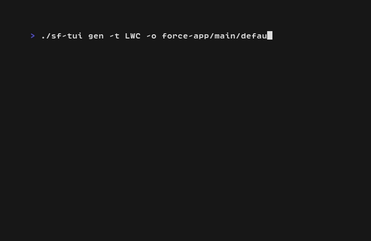
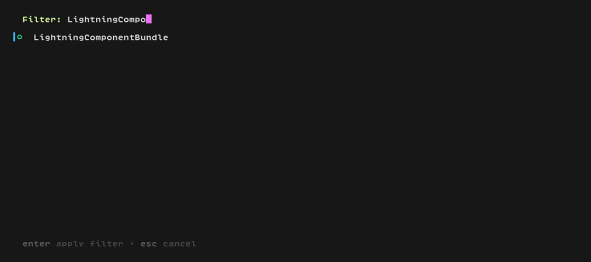

# stew

`stew` is a terminal user interface (TUI) for the Salesforce CLI (`sf`), built with Go and the [Bubble Tea](https://github.com/charmbracelet/bubbletea) framework. It aims to provide a more interactive and visual way to manage Salesforce environments and metadata directly from the command line.

## Features

### 1. Org Picker
Easily switch between your authenticated Salesforce orgs.
- Lists all authenticated orgs (Scratch Orgs, Sandboxes, Dev Hubs, etc.).
- Displays aliases, usernames, and instance URLs.


### 2. Metadata Generator
Streamline the creation of new Salesforce metadata with a simple, interactive form.
- **Lightning Web Components (LWC)**: Generate new LWC components.
- **Apex Classes**: Create new Apex classes.
- **Apex Triggers**: Create new Apex triggers with SObject selection.
- Input validation to ensure metadata names are not empty.
- Real-time feedback on successful creation.


### 3. Metadata Retriever - Package XML generator
Browse, search, and select metadata from your Salesforce org to generate a package.xml file.
- Select a metadata type
- Browse all available metadata of that type and pick one or more items
- Generate a package.xml file with the selected metadata.


## Prerequisites

- [Go](https://go.dev/doc/install) (1.19 or later)
- [Salesforce CLI (sf)](https://developer.salesforce.com/tools/sfdxcli) installed and authenticated with at least one org.

## Installation

Clone the repository and build the binary:

```bash
git clone https://github.com/brtheo/stew.git
cd stew
./build.sh
